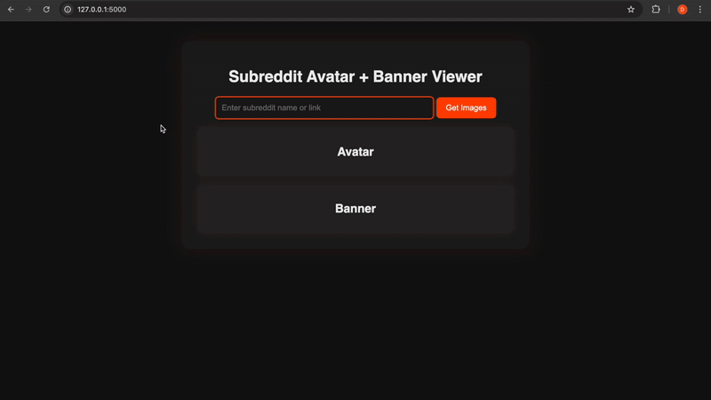
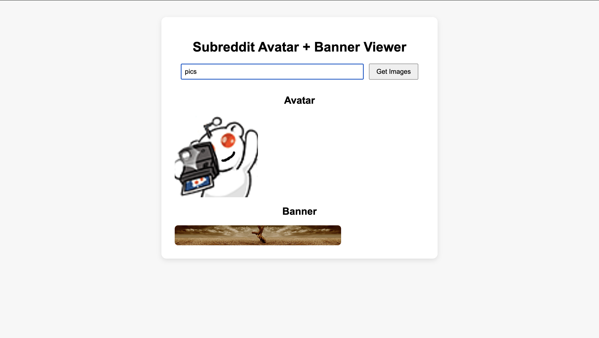

# Snap My Sub

A simple web tool that fetches and displays a subreddit's avatar and banner images based on user input.

---

## Features

- Fetches subreddit avatars and banner images using Reddit's public API
- Clean dark mode UI
- Smooth animations and loading spinner
- Mobile-responsive design
- Light ad placeholders for monetization

---

## Built With

- Flask (Python backend)
- HTML/CSS/JavaScript (Frontend)
- Hosted images and JSON parsing

---

## How It Works

1. Enter a subreddit name (or full link) into the input field.
2. Press "Get Images" or hit "Enter."
3. The site's backend pulls the data and displays the avatar/banner.

---

> 🟢 **Live Now at [snapmysub.com](https://snapmysub.com)**

---

## Demo

---

## Version 1.0

---

## Contributing

Pull requests are welcome! For major changes, please open an issue first to discuss what you would like to change.

---

## License

MIT License
